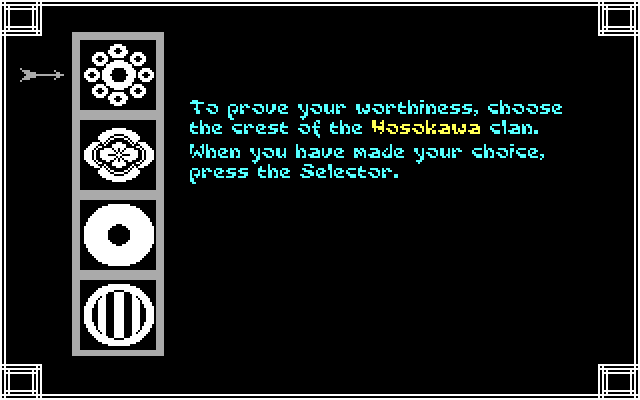
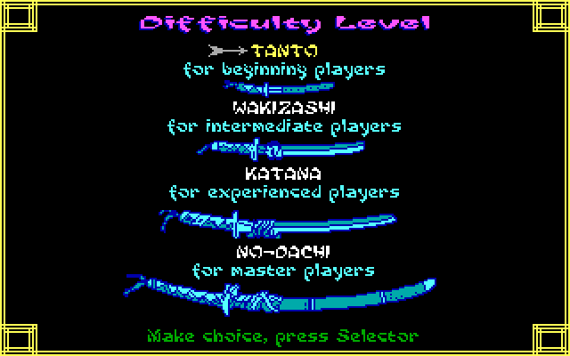
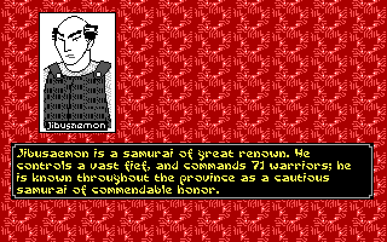
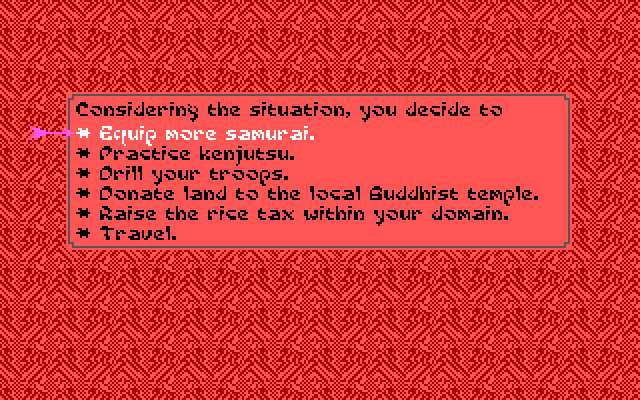
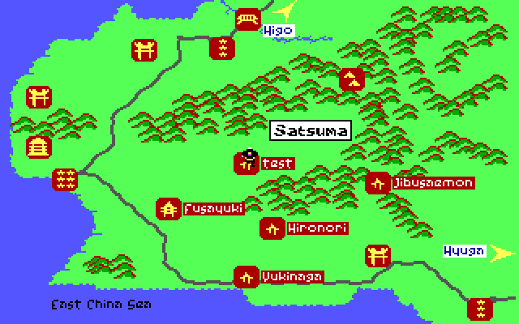
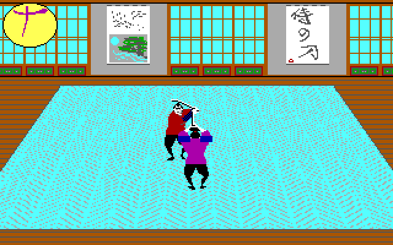
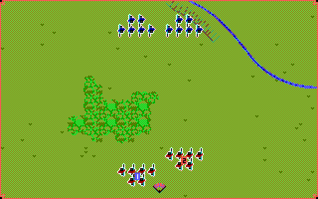
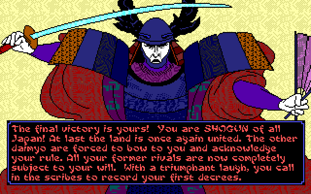
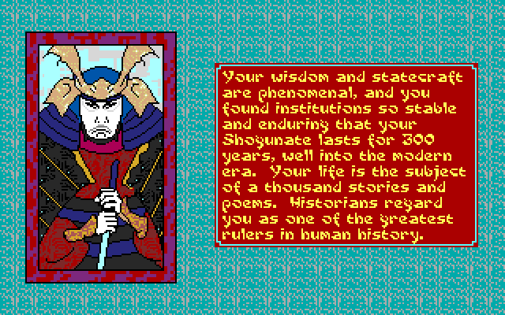

	
	
	
	

# OpenSamurai

OpenSamurai is an unofficial reconstruction of *Sword of the Samurai* (MicroProse, DOS, 1989).

It is written in C and rebuilt from the original program, the way [SDLPoP2](https://github.com/ToolAssisted-run/SDLPoP2) was for Prince of Persia 2. It plays the original game's data files, so you need your own copy of the game.

The original game is a chain of separate DOS programs: a setup, the title and character creation, the role-playing game, and one program each for the duels, the melees and the battles. OpenSamurai is one program with all of them inside, each rebuilt from its machine code and checked against the real game running in an emulator.

## How to play

1. Download the build for your system from the [**latest development build**](https://github.com/ToolAssisted-run/OpenSamurai/releases/tag/dev): `opensamurai-windows-x86_64-….zip` or `opensamurai-linux-x86_64-….tar.gz`.
2. Unpack it into the folder with your copy of the game (the one with `START.EXE`, `RP.EXE` and the `.CAT` files). See [Getting the game](#getting-the-game).
3. On Windows, double-click `opensamurai.exe`. On Linux, run `./opensamurai` in that folder.

The development build is rebuilt after every change. If you want a build that never changes, pick a dated [**nightly build**](https://github.com/ToolAssisted-run/OpenSamurai/releases).

The game asks the original's crest question at the start, so keep the manual at hand. Saved games (Alt+S at the Home Option scroll) go to the game's folder, as in the original. The keys are listed below.

Found a bug or a glitch, or have an idea? Everything is welcome on the [issues page](https://github.com/ToolAssisted-run/OpenSamurai/issues).

## Screenshots

## Keys

### The original game's keys

| | |
|---|---|
| Arrows, Home, PgUp, End, PgDn | move the cursor, walk on the maps (the numeric keypad works too) |
| Enter or Space | the selector: choose |
| Backspace | the second selector (in duels: parry) |
| Esc | back |
| F1 | the Status Scroll: you and your rivals |
| F2 | the Strategic Map |
| F3 | the Summary Scroll |
| Alt+S / Alt+R | save / restore the game (at the Home Option scroll) |
| Alt+N | start a new game |
| Alt+V | music and effects, effects only, or silence |
| Alt+Z | full graphics on or off |
| Alt+J | calibrate the joystick again |
| Alt+Q | quit |

### Duels and melees

| | |
|---|---|
| Arrows or the numeric keypad | move, and aim your swing |
| Enter | swing (in melees: strike, shoot, pick up, put down) |
| Backspace | parry (in melees: as Enter) |
| Space | in melees: pause |

### Battles

| | |
|---|---|
| Up / Down, Left / Right | on the formation screen: choose the formation, mirror it |
| 1 to 9 | select a unit |
| 0 | select the unit nearest the cursor |
| Enter | select the unit under the cursor |
| Arrows, Home, PgUp, End, PgDn | move the cursor |
| + or = | the selected unit turns and marches to the cursor |
| - | march to the cursor without turning |
| * | turn to face the cursor |
| Esc | deselect |
| R | retreat: the whole army leaves the field |
| Space | pause |

### Joystick

A joystick or game controller that is plugged in is the game's joystick. OpenSamurai does the setup's calibration for you, and Alt+J calibrates it again. `/NJ` leaves it out.

## Command line

You can also start OpenSamurai from a terminal:

    opensamurai [GAME FOLDER] [/NT] [/NJ] [/AA | /AR | /AI | /AT | /AN]

All options are optional, and are the original setup's:

| Option | Default | What it does |
|---|---|---|
| `GAME FOLDER` | the program's folder, else the current one | where your copy of the game is |
| `/NT` | off | skip the title |
| `/NJ` | a joystick is used if there is one | no joystick |
| `/AA` | yes | sound: the AdLib |
| `/AR` | | sound: the Roland MT-32 (needs its ROMs, see below) |
| `/AI` | | sound: the IBM PC speaker |
| `/AT` | | sound: the Tandy |
| `/AN` | | no sound |

On Windows, the options also work in a shortcut, alone (`opensamurai.exe /AR`) or after the folder.

If something is wrong, for example a missing game file, OpenSamurai says what and stops.

## Settings

OpenSamurai needs no settings file: the options above are the original setup's, and the game keeps its own (Alt+V, Alt+Z).

The Roland MT-32 needs its two ROMs, a control ROM and a PCM ROM. They are Roland's and not included, so you provide your own. Put the two files (any names: they are recognized by their contents) in one of these folders, looked at in this order:

1. the folder named by the `OPENSAMURAI_MT32ROMS` environment variable;
2. your data folder's `roms` (on Linux `~/.local/share/OpenSamurai/roms`, on Windows `%APPDATA%\OpenSamurai\roms`);
3. the `roms` folder next to the program;
4. the game's folder.

An original MT-32's ROMs (versions 1.04 to 1.07) are the sound the game was made for; a later MT-32's or a CM-32L's work too. Without them `/AR` plays the AdLib's sound and says where it looked.

`OPENSAMURAI_WAV=file.wav` records the sound, and `OPENSAMURAI_MIDI=file.mid` the MT-32's music.

Every random number in a game comes from one seed, taken from the clock when OpenSamurai starts and shown in the terminal. `OPENSAMURAI_SEED=N` sets it, and the same seed draws the same random numbers.

With the IBM PC speaker the title runs slower, as it does in the original.

## Building

OpenSamurai builds with [meson](https://mesonbuild.com). The MT-32 is [Munt](https://github.com/munt/munt)'s libmt32emu, a git submodule, built with CMake:

    git submodule update --init
    meson setup build
    meson compile -C build
    build/frontend/opensamurai path/to/the/game

Windows builds are made on Linux with mingw-w64 (`tools/x86_64-w64-mingw32.ini`), against SDL2's MinGW release:

    tools/build-bundle.sh --platform windows --out DIR

`tools/build-bundle.sh --platform linux|windows --out DIR` makes the same package the releases contain.

Every push is built by CI. When CI passes, the `dev` release is replaced, and once a day a dated `nightly-YYYY-MM-DD` release is added.

### Tests

The tests that play the game need the game's files, which are not in this repository:

    meson setup build -DgameDir=path/to/the/game
    meson test -C build

`-DoracleTests=true` adds the comparisons against recordings of the original DOS game.

### Where things are

- `source/`: the game. Each original program is rebuilt whole (`start_core.c`, `rp_core.c`, `duelexe_core.c`, `battleexe_core.c`, `meleeexe_core.c`), with the duel, battle and melee simulations in readable C (`duel.c`, `battle.c`, `melee_core.c`), the sound drivers (`isound.c`, `tsound.c`, `asound.c`, `rsound.c`) and models of the chips they drive.
- `frontend/`: the [SDL2](https://www.libsdl.org) frontend.
- `docs/FINDINGS.md`: the reconstruction, program by program, and the game's rules as the code has them.
- `tools/` and `tests/`: helpers and the test suites.

## License

OpenSamurai is free software under the GNU General Public License v3.0 or later, with no warranty. See [LICENSE](LICENSE) for the details.

This is an unofficial project for research and education. It is not affiliated with or endorsed by the game's rights holders, who own the game and its trademarks. No game data is included.

OpenSamurai does not let you skip the original game's copy protection.

## Credits

- [SDLPoP2](https://github.com/ToolAssisted-run/SDLPoP2), the reconstruction OpenSamurai follows.
- [Munt](https://github.com/munt/munt), by the Munt team (LGPL-2.1-or-later), emulates the Roland MT-32.
- [SDL2](https://www.libsdl.org) (zlib license) draws the game and plays its sound.
- *Sword of the Samurai* (MicroProse, 1989).

## Getting the game

OpenSamurai needs the original game's files, which are not included.

*Sword of the Samurai* is sold on [Steam](https://store.steampowered.com/app/327950/Sword_of_the_Samurai/) and [GOG.com](https://www.gog.com), with its manual. An original copy for MS-DOS works too. OpenSamurai is built against the DOS release, version 445.03.
